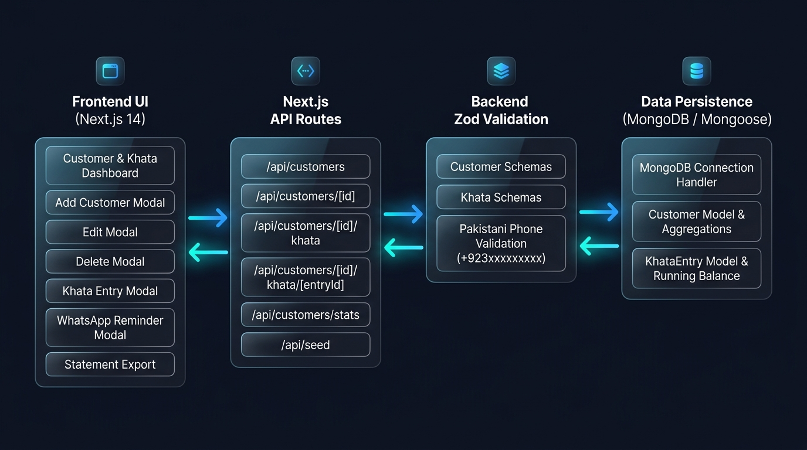

# 🚀 Day 15–19 Capstone — Customers & Khata CRUD Specialist Module

Welcome to **Day 15–19 of the HisabDo MERN / Next.js Internship Program**. This module establishes the core **Customer Directory & Digital Khata Udhar Management Engine**, complete with full CRUD REST API routes, strict backend **Zod schema validation**, live database models (**MongoDB / Mongoose** with in-memory persistence layer), responsive frontend modals, running balance calculators, and Pakistani WhatsApp dues reminder generators.

---

## 🏛️ System Architecture Diagram



---

## 📋 Role Overview: Customers & Khata CRUD Specialist

As the **Customers & Khata CRUD Specialist**, the following objectives and components have been designed and implemented in `Day 15-19/`:

1. **Full CRUD REST API Routes**:
   - `GET /api/customers` — Query customer directory with search, status filters (You Will Get / You Will Give / Settled), categories, sorting, and aggregated stats.
   - `POST /api/customers` — Register new customer profile with Zod validation and duplicate phone detection.
   - `GET /api/customers/[id]` — Fetch customer profile, transaction count, and recent ledger activity.
   - `PUT /api/customers/[id]` — Update customer record with partial/strict Zod validation.
   - `DELETE /api/customers/[id]` — Delete customer profile with automatic cascade cleanup of ledger history.
   - `GET /api/customers/[id]/khata` — Retrieve all transaction entries with computed running balances.
   - `POST /api/customers/[id]/khata` — Record Credit (You Gave Udhar) or Payment (You Got Wasooli) with dynamic customer net balance updates.
   - `PUT /api/customers/[id]/khata/[entryId]` — Edit existing transaction entry with balance recalculation.
   - `DELETE /api/customers/[id]/khata/[entryId]` — Delete a transaction entry with automatic balance restoration.
   - `GET /api/customers/stats` — High-level dashboard aggregate metrics (Total Receivables, Payables, Net Position).
   - `POST /api/seed` — 1-Click Pakistani merchant dataset seeder (Ali Traders, Bismillah Autos, Khan Electronics, Fatima Boutique, Usman Retailer).

2. **Backend Validation with Zod Engine (`src/lib/validations/`)**:
   - **Pakistani Phone Number Regex**: `/^(?:\+92|92|0)?3[0-9]{9}$/` enforcing valid cellular networks (+92300..., 0300..., 92321...).
   - **Customer Schemas**: `customerCreateSchema`, `customerUpdateSchema`, `customerQuerySchema`.
   - **Khata Entry Schemas**: `khataEntryCreateSchema`, `khataEntryUpdateSchema` (rejection of negative/zero amounts, type enforcement).
   - **Structured Error Responses**: Standardized JSON 400 Bad Request responses with inline field error mapping.

3. **Database Layer (`src/models/` & `src/lib/db.js` & `src/lib/db-store.js`)**:
   - Mongoose `Customer` and `KhataEntry` models with schema validation, indexes, and timestamps.
   - Resilient database engine supporting MongoDB connections with persistent in-memory fallback for zero-configuration testing.

4. **Frontend UI & Interactive Modals (`src/components/customers/`)**:
   - `AddCustomerModal.jsx`: Register customer with real-time Zod error feedback.
   - `EditCustomerModal.jsx`: Update profile, credit limits, categories, and payment terms.
   - `DeleteCustomerModal.jsx`: Cascade deletion confirmation with pending dues warning.
   - `AddKhataEntryModal.jsx`: Record Credit vs Payment with payment method selector (Cash, EasyPaisa, JazzCash, Bank, Cheque).
   - `EditKhataEntryModal.jsx`: Modify past transactions.
   - `WhatsAppReminderModal.jsx`: Pre-filled Urdu/English friendly, overdue, and formal dues statements with 1-click WhatsApp Web launch.
   - `StatementModal.jsx`: Printable statement invoice preview and CSV export.

---

## 📁 Project Folder Structure

```text
Customers & Khata CRUD/
├── README.md                           # Technical Documentation & Specialist Guide
├── package.json                        # Dependencies (Next 14, React 18, Zod, Mongoose, Lucide)
├── next.config.js
├── test-customers-khata-crud.js        # Automated API & Zod Validation Test Suite
├── screenshots/
│   └── architecture_diagram.png        # Architecture PNG Diagram
└── src/
    ├── app/
    │   ├── api/
    │   │   ├── customers/
    │   │   │   ├── route.js            # GET / POST Customers
    │   │   │   ├── [id]/
    │   │   │   │   ├── route.js        # GET / PUT / DELETE Customer by ID
    │   │   │   │   └── khata/
    │   │   │   │       ├── route.js    # GET / POST Khata Ledger Entries
    │   │   │   │       └── [entryId]/
    │   │   │   │           └── route.js # PUT / DELETE Specific Transaction
    │   │   │   └── stats/
    │   │   │       └── route.js        # GET Aggregated Metrics
    │   │   └── seed/
    │   │       └── route.js            # POST Seed Sample Data
    │   ├── dashboard/
    │   │   ├── layout.jsx              # Protected Dashboard Layout
    │   │   ├── page.jsx                # Overview Dashboard
    │   │   ├── customers/
    │   │   │   └── page.jsx            # Core Customer & Khata Management Workspace
    │   │   ├── cashbook/
    │   │   │   └── page.jsx            # Digital Cashbook
    │   │   ├── businesses/
    │   │   │   └── page.jsx            # Multi-Branch Switcher
    │   │   └── settings/
    │   │       └── page.jsx            # Merchant Settings
    │   ├── globals.css                 # Glassmorphism & Responsive Helper CSS
    │   └── layout.jsx                  # Root Layout & Providers
    ├── components/
    │   ├── Navbar.jsx
    │   ├── Footer.jsx
    │   ├── Sidebar.jsx
    │   ├── ui/                         # Reusable UI (Button, Input, Card, Modal, Table, Badge, Select, Alerts)
    │   └── customers/                  # 7 Interactive Customer & Khata Modals
    │       ├── AddCustomerModal.jsx
    │       ├── EditCustomerModal.jsx
    │       ├── DeleteCustomerModal.jsx
    │       ├── AddKhataEntryModal.jsx
    │       ├── EditKhataEntryModal.jsx
    │       ├── WhatsAppReminderModal.jsx
    │       └── StatementModal.jsx
    ├── context/
    │   └── AuthContext.jsx             # Auth & Active Branch Context
    ├── lib/
    │   ├── db.js                       # Mongoose Database Connection
    │   ├── db-store.js                 # High-Reliability Database Store Layer
    │   └── validations/
    │       ├── customerSchema.js       # Zod Customer Validation
    │       ├── khataSchema.js          # Zod Khata Transaction Validation
    │       └── validate.js             # Zod Request Validation Helpers
    └── models/
        ├── Customer.js                 # Mongoose Customer Schema
        └── KhataEntry.js               # Mongoose Khata Entry Schema
```

---

## 🏃 Quick Start Guide

### 1. Install Dependencies
```bash
cd "Customers & Khata CRUD"
npm install
```

### 2. Run Automated Test Suite
```bash
npm test
# or
node test-customers-khata-crud.js
```

### 3. Launch Development Server
```bash
npm run dev
```

Open [http://localhost:3000/dashboard/customers](http://localhost:3000/dashboard/customers) to interact with the live Customer & Khata module.

---

## 🧪 Test Verification Coverage

The automated test script (`test-customers-khata-crud.js`) validates:
1. **Pakistani Phone Validation**: Accept `+923001234567`, `03001234567`, `923219876543`; Reject invalid formats.
2. **Customer Schema Constraints**: Min/max name length, credit limits, categories.
3. **Khata Entry Constraints**: Rejection of zero/negative amounts.
4. **Customer CRUD Lifecycle**: Create, Read by ID, Search by query, Update profile.
5. **Khata Dynamic Running Balance**: Adding credit increases net due, recording payment decreases net due, running balance recalculation upon edit or delete.
6. **Cascade Cleanup**: Deleting customer purges all attached transactions.
7. **Aggregated Stats**: Verification of Total Receivable, Total Payable, and Net Position.

---

## 📧 Submission Info
* **Author**: Muhammad Hamza Arif
* **Assigned Role**: Customers & Khata CRUD Specialist
* **Internship Track**: HisabDo MERN / Next.js Track (Day 15–19)
* **Submitted to**: `hisabdo.app@gmail.com`
