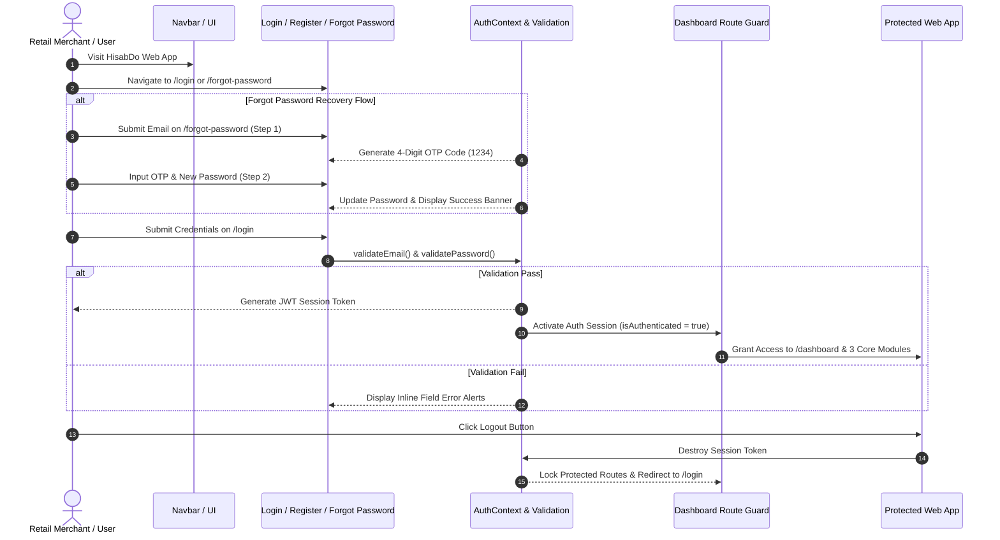

# 🚀 Day 13 Capstone Project — Authentication Foundation & User Research

Welcome to **Day 13 of the HisabDo MERN / Next.js Internship Program**. Today's implementation establishes the **Authentication & User Management Foundation**, introduces the **Forgot Password UI Workflow (`/forgot-password`)**, presents a **5 Real User Product Research Report**, and embeds the **Mermaid Authentication Flow Diagram**.

---

## 📊 Short Progress Report (Day 13)

Today we successfully accomplished all required tasks inside `Day 13/`:

1. **User Research Sub-Task (`DAY13_USER_RESEARCH_REPORT.md`)**:
   - Introduced HisabDo to **5 real retail merchants** in Pakistan (*Kiryana owner, Mobile repair seller, Wholesale distributor, Pharmacy manager, Garments retailer*).
   - Documented feedback, UX issues found, recommended improvements, and visual evidence mockups for GitHub submission.

2. **Authentication Pages & UI Workflow**:
   - **Merchant Sign In (`/login`)**: Email & password validation, simulated JWT session token, and protected route redirect.
   - **Merchant Registration (`/register`)**: Onboarding form with matching password verification.
   - **Forgot Password Page UI (`/forgot-password`)**: 2-Step password reset UI featuring 4-digit OTP code verification (`1234`), password strength validation, and success notification banner.

3. **Route Protection & Auth Context (`AuthContext.jsx` & `dashboard/layout.jsx`)**:
   - React Auth Context managing active user state, session token, and selected business branch context (`activeBranch`).
   - Protected `/dashboard` routes enforcing Auth Guard redirects for unauthenticated users.

---

## 📐 Authentication Flow Diagram (Mermaid)



---

## 📌 Submission & Minimum Requirements Checklist

- [x] **1. 5 Real User Research Report**: Documented in [`Day 13/DAY13_USER_RESEARCH_REPORT.md`](file:///e:/Hamza%20doc/HisabDo%20Internship/Day%2013/DAY13_USER_RESEARCH_REPORT.md).
- [x] **2. Authentication UI Pages**:
  - Login Page (`/login`)
  - Register Page (`/register`)
  - Forgot Password Page UI (`/forgot-password`) with 2-step OTP verification
- [x] **3. Authentication Flow Diagram**: Embedded Mermaid sequence diagram.
- [x] **4. Form Validation & Route Protection**: Validation engine (`validation.js`) and Auth Guard layout.
- [x] **5. 3 Core Functional CRUD Modules**: Digital Cashbook, Customer Udhar Book, Multi-Business Branch Management.
- [x] **6. GitHub Repository**: Tracked and committed on branch `main` at `https://github.com/m-hamza-arif-0694/hamza-mern.git`.

---

## 📁 Day 13 Project Folder Structure

```text
Day 13/
├── DAY13_USER_RESEARCH_REPORT.md  # 5 Real User Feedback & Research Report
├── src/
│   ├── app/
│   │   ├── (auth)/
│   │   │   ├── login/
│   │   │   │   └── page.jsx      # Validated Login Page
│   │   │   ├── register/
│   │   │   │   └── page.jsx      # Validated Register Page
│   │   │   └── forgot-password/
│   │   │       └── page.jsx      # 2-Step OTP Reset Password UI
│   │   ├── (dashboard)/
│   │   │   └── dashboard/
│   │   │       ├── layout.jsx    # Auth-Protected Dashboard Layout
│   │   │       ├── page.jsx      # Protected Dashboard Overview
│   │   │       ├── cashbook/
│   │   │       │   └── page.jsx  # Module 1: Cashbook (CRUD)
│   │   │       ├── customers/
│   │   │       │   └── page.jsx  # Module 2: Udhar Customer Ledger (CRUD)
│   │   │       └── businesses/
│   │   │           └── page.jsx  # Module 3: Multi-Business Branches (CRUD)
│   │   ├── globals.css
│   │   └── layout.jsx            # Root Layout with AuthProvider
│   ├── components/
│   │   ├── ui/                   # Reusable Component System
│   │   ├── Navbar.jsx
│   │   ├── Footer.jsx
│   │   └── Sidebar.jsx
│   ├── context/
│   │   └── AuthContext.jsx       # Auth & Session Context Provider
│   └── lib/
│       └── validation.js         # Centralized Validation Engine
├── next.config.js
├── package.json
└── README.md
```

---

## 🏃 How to Run the Day 13 Application

### 1. Install Dependencies
```bash
cd "Day 13"
npm install
```

### 2. Launch Next.js Development Server
```bash
npm run dev
```

Open [http://localhost:3000](http://localhost:3000) to view the application.

---

## 📧 Submission Info
* **Author**: Muhammad Hamza Arif
* **Track**: HisabDo MERN / Next.js Internship Track (Day 13 Capstone)
* **Submitted to**: `hisabdo.app@gmail.com`
