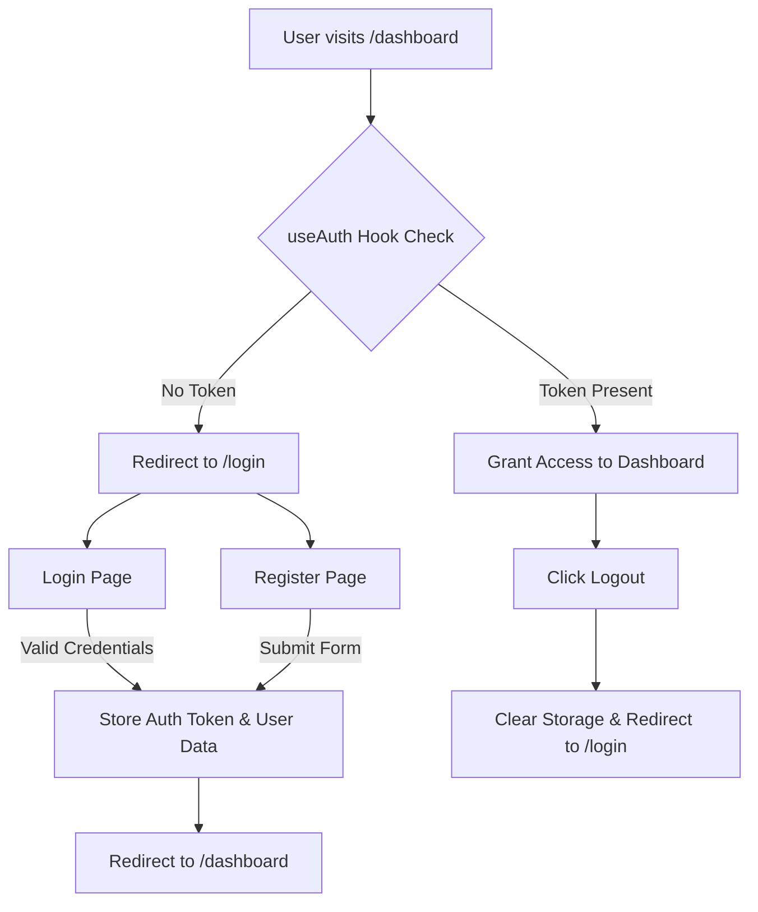

## 🔐 Day 13: Authentication & User Management Foundation

### 📊 Authentication Flow Diagram

### 📝 Progress Report

#### **Completed Objectives**
* **Auth Page UI**: Built responsive, dark-themed interfaces for Login, Register, and Forgot Password pages with intuitive layout navigation (`Back to Home` links).
* **Form Validation**: Implemented strict schema validation using `react-hook-form` and `zod` for all authentication inputs (email formats, password minimum lengths, and password matching).
* **Credential Verification & Feedback**: Added credential validation against stored user accounts, providing actionable UI error messages for unregistered users or incorrect passwords.
* **Route Protection**: Developed a custom `useAuth` hook to guard private routes (`/dashboard`), automatically redirecting unauthenticated users to the login screen.
* **Session & State Management**: Integrated local storage session handling along with a persistent **Log Out** mechanism in the main dashboard navigation.
* **Full CRUD Operations**: Enhanced core transaction management on the dashboard to support full Create, Read, Update, and Delete operations with persistent browser storage.
